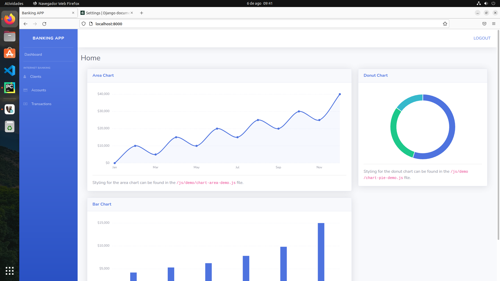

# A Simple Django Stack

A clean, organized django project.
<br />
</img>
# Installation
Pré requisites:<br />
Python 3.10<br />
pip3<br />
virtualenv<br />

Create Virtual Environment
```
virtualenv venv
```


Active Virtual Environment
```
source venv/bin/activate
```

```
pip install code/requirements-txt
```


# Development

run server<br>
```
python manage.py runserver
```

run server with Gunicorn<br>
```
gunicorn meuapp.wsgi
```

RabbitMQ on docker<br>
```
sudo docker run -d -p 5672:5672 rabbitmq
```

Celery<br>
```
celery -A meuapp worker -l info
```

Task Scheduler<br>
You can enter django admin panel and register periodic tasks.
```
celery -A proj beat -l info --scheduler django_celery_beat.schedulers:DatabaseScheduler
```
You can run both together with (using django-celery-beat database Scheduler):
```
celery -A proj worker --beat --scheduler django_celery_beat.schedulers:DatabaseScheduler
```

Flower<br>
```
celery -A meuapp flower
```
